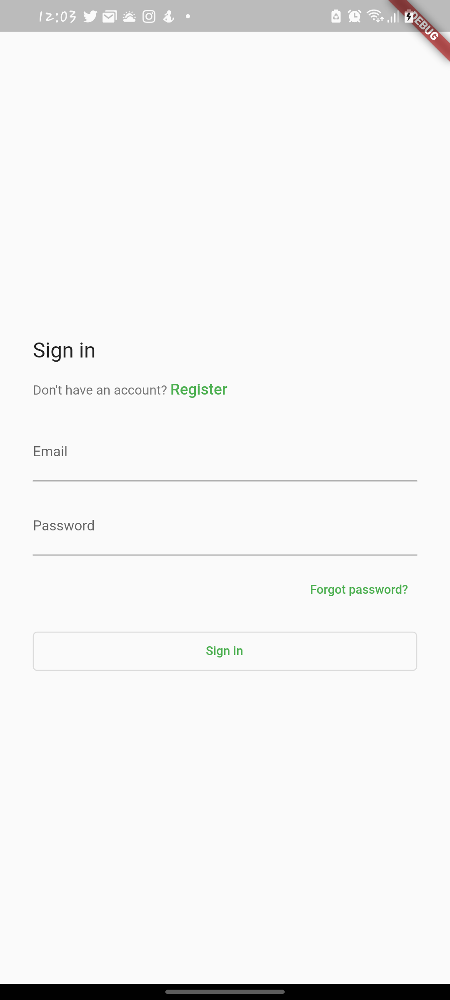
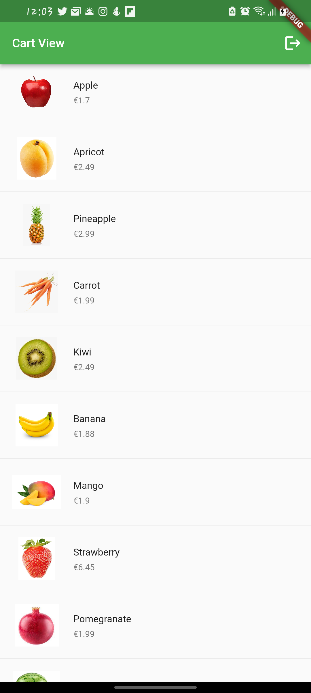
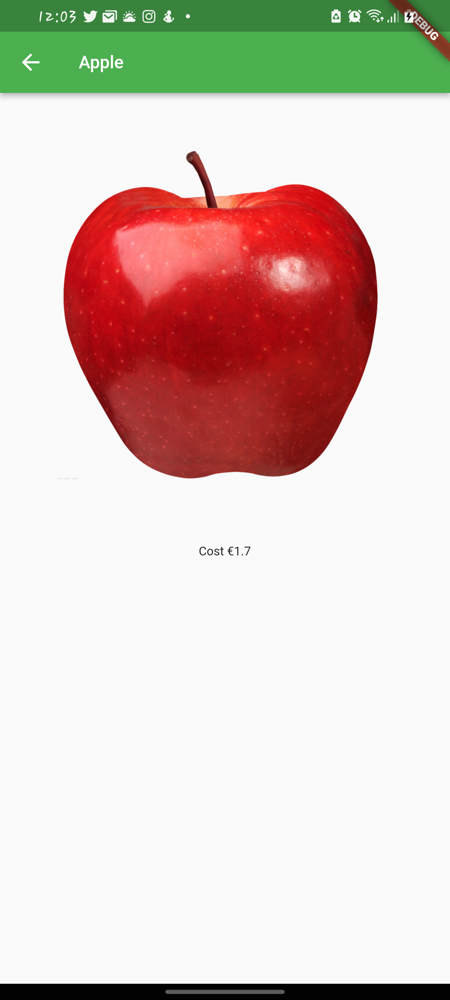

# shopping_app

A simple Flutter app that displays a simple shopping cart stored online

## Screenshots Mobile 📷📲

### Setup
- `git clone https://github.com/Bavon101/fresh_flow_shopping_store.git`
- `cd Leaderboard`
- `flutter pub get`
- `flutter run`
## dependencies
-  `cupertino_icons: ^1.0.2`
-  `firebase_auth: ^3.3.9`
-  `cloud_firestore: ^3.1.10`
-  `firebase_analytics: ^9.1.2`
-  `flutterfire_ui: ^0.3.5+1`
-  `firebase_core: ^1.13.1`
-  `cached_network_image: ^3.2.0`
-  `shimmer: ^2.0.0`
## NOTE
- The project uses `cloud_firestore` making the data accessible while offline
- The images are rendered using `cached_network_image` which cache the images for fatter load-time and offline accessibility
- The project displays mimicry item data card without edit options only viewing.
- Events are logged to Firebase using the `firebase_analytics`
- The login UI is by default called from `flutterfire_ui` that takes care of the  logic , awesome right ? 😉. 
## Built With
- Flutter
- Firebase

## Authors

👤 **Author**

- GitHub: [@Bavon101](https://github.com/Bavon101)